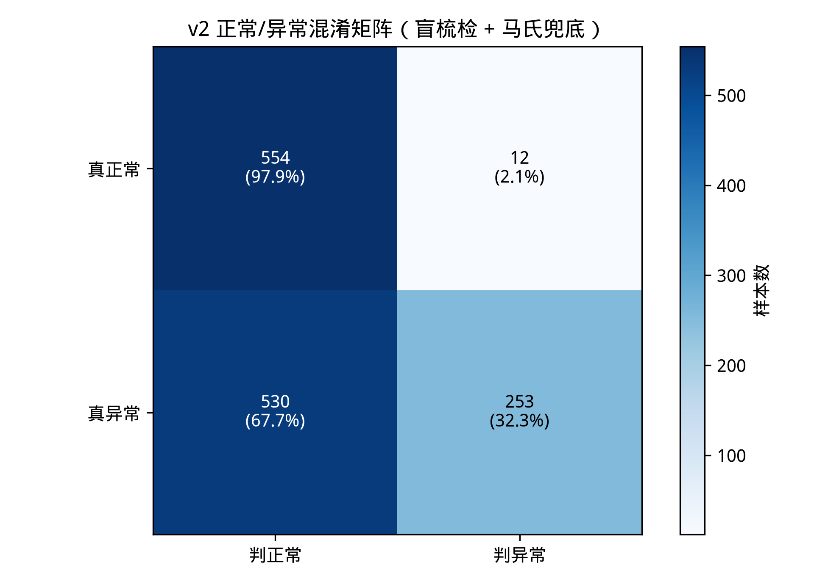
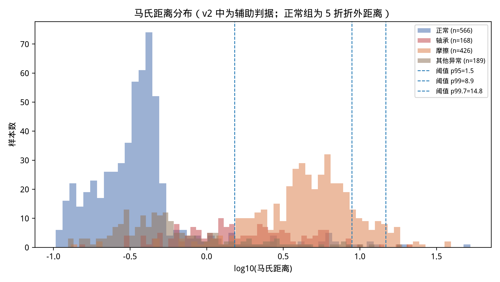
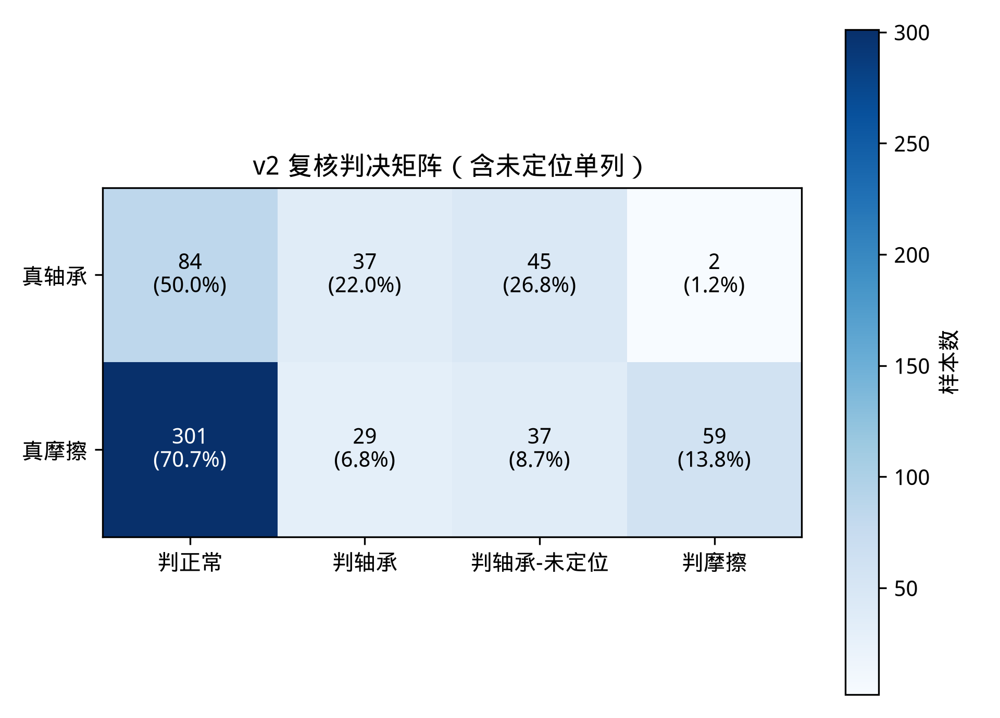
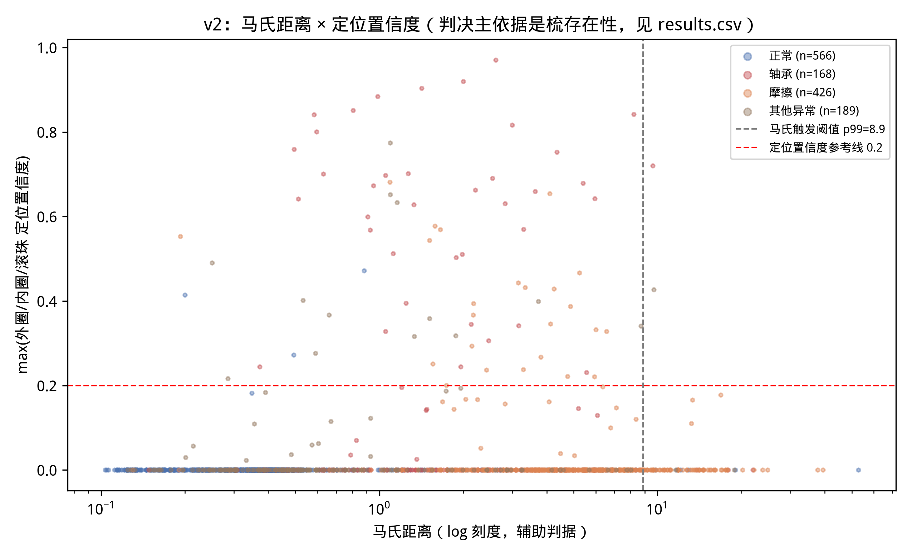
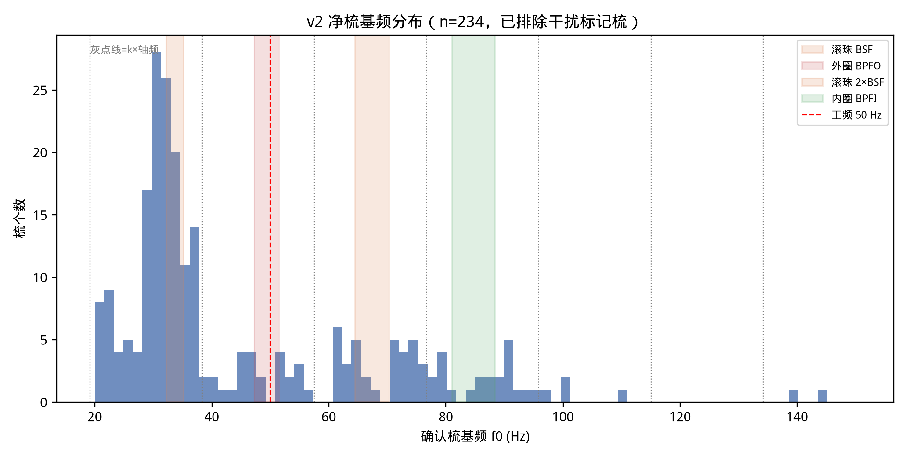

# 规则 V2 对照报告（盲梳检存在性 + 频带落入定位）

- 生成时间：2026-09-21T17:58:57
- 规则：`--rules v2`（原型 `merged_proposal/unified_prototype.py`，v1 路径保留可用）
- 数据：`analysis/reports/audio_assets/manifest.tsv`；成功 1349/1349 条，失败 0 条；全量耗时 16.3 min（均值 0.72 s/条）

## 1. 口径声明

- `description` 为**人工标注的声称值，非拆解确认**；所有「准确率」为与标注的一致率。
- 子集定义与 v1 完全相同：正常 566（status=1）/ 异常 783（status=-1），其中轴承（精确「轴承」）168、摩擦（含「摩擦」）426、其他异常 189、详细部位参考 86；「爆量程」3 条在其他异常内。
- v2 判决四类：正常 / 轴承（已定位）/ 轴承-未定位 / 摩擦；马氏触发级（p99，域内 5 折标定，与 v1 同一份）降级为无梳时的辅助判据。
- v2 匹配**不依赖转速估计**；rpm_est 仅记录。定位频带由标称转速窗 1100–1200 rpm 预先推出（滚珠 32.2–35.2 / 外圈 47.3–51.6 / 滚珠 64.5–70.3 / 内圈 81.1–88.4 Hz），理论复核容差 ±4%。
- 干扰防护：f0 与 k×19.167 Hz（轴频谐波）或 50.0 Hz（工频）在 1.5 谱线内吻合的梳、以及下探后基频 <20 Hz 的轴频族梳，打 suspected_interference 标记并从轴承判决排除（仍记录）。

## 2. v1 vs v2 对照

| 指标 | v1（理论锚定级联） | v2（盲梳检） |
|---|---|---|
| 正常误报率 | 1.1%（6/566） | 2.1%（12/566） |
| 异常检出率 | 9.3%（73/783） | 32.3%（253/783） |
| 轴承检出率（全体口径） | 1.8%（判轴承 3/168） | 22.0% 仅定位 / 48.8% 含未定位（n=168） |
| 摩擦检出率（全体口径） | 15.5%（66/426） | 13.8%（59/426） |
| 低置信数 | 64 | 67 |
| 86 条详细部位 argmax 一致率 | 30.2%（26/86） | 31.4%（27/86；有证据子集 1/4） |

v2 核心判据：轴承全体口径检出率能否突破 v1 理论锚定的结构性上限（v1 复核级单级证据率 28.0%）。见上表第 3 行与 §5。

## 3. v2 检出漏斗（按子集）

| 子集 | n | A 梳确认 | B 倒谱互证 | 含干扰标记 | 净梳 | 定位成功 | 未定位 |
|---|---|---|---|---|---|---|---|
| 正常 | 566 | 29 | 7 | 1 | 6 | 4 | 2 |
| 轴承 | 168 | 131 | 105 | 30 | 82 | 37 | 45 |
| 摩擦 | 426 | 94 | 67 | 3 | 66 | 29 | 37 |
| 其他异常 | 189 | 79 | 56 | 14 | 42 | 16 | 26 |

## 4. 正常/异常（v2 判决）

- 混淆矩阵：TP/FN/FP/TN = 253/530/12/554；异常检出率 32.3%，正常误报率 2.1%。
- 异常检出的驱动分解：梳证据 190 条 / 马氏兜底 63 条；正常误报中梳证据 6 条 / 马氏兜底 6 条。

## 5. 轴承/摩擦（v2 判决）

| 真值 | n | 判正常 | 判轴承 | 判轴承-未定位 | 判摩擦 | 检出率口径 |
|---|---|---|---|---|---|---|---|
| 轴承 | 168 | 84 | 37 | 45 | 2 | 全体：仅定位 22.0% / 含未定位 48.8%；有梳定位成功率 45.1%（37/82） |
| 摩擦 | 426 | 301 | 29 | 37 | 59 | 全体 13.8%；马氏触发口径 89.4%（59/66） |

「轴承-未定位」= 确认存在轴承故障特征（梳 A+B 确认）但频带落入与补救路径均无法定位，单列不强行归类。

### 低置信样本

低置信规则（沿用 v1 精神）：判摩擦但马氏距离 < 2×阈值，或判轴承但 max 定位置信度 < 0.2。共 **67 条**，子集分布：{'摩擦': 57, '轴承': 2, '正常': 5, '其他异常': 3}。明细见 eval_detail.json。

## 6. 参考：86 条详细部位标签的 argmax 一致率（不作正式结论）

- argmax 与标注一致率：**27/86 = 31.4%**（外圈 26/28；滚珠 0/30；内圈 1/28）。
- 其中 max_conf=0（无定位证据）82 条（argmax 退化为外圈）；有证据子集：**1/4 = 25.0%**。

## 7. v2 特有分析

### 梳基频分布

净梳（确认且未标记干扰）共 234 个，分布直方图如下——若盲检有效，梳基频应聚类到四个特征频带：

### 干扰防护命中统计

- 被标记梳数：**51**（涉及 48 个文件）
  - 低频梳(f0<20Hz,疑轴频族)：40 个梳
  - 工频50Hz：5 个梳
  - 轴频谐波2×19.167Hz：4 个梳
  - 轴频谐波4×19.167Hz：2 个梳

### 「轴承特征存在但无法定位」清单

共 **110 条**（子集分布：{'正常': 2, '轴承': 45, '摩擦': 37, '其他异常': 26}）。

| id | 子集 | 梳基频 (Hz) | description |
|---|---|---|---|
| 10040 | 摩擦 | 30.65 | 摩擦 |
| 10098 | 轴承 | 22.19 | 轴承 |
| 10117 | 摩擦 | 70.66 | 摩擦 |
| 10662 | 轴承 | 37.14 | 轴承 |
| 10690 | 其他异常 | 29.16 | 15 |
| 10873 | 其他异常 | 110.13;64.81 | 故障 |
| 11109 | 摩擦 | 31.17 | 摩擦 |
| 11459 | 轴承 | 20.52 | 轴承 |
| 11462 | 轴承 | 29.74 | 轴承 |
| 11623 | 其他异常 | 62.08 |  |
| 12016 | 摩擦 | 63.64 | 摩擦 |
| 12017 | 正常 | 75.79 | 17 |
| 12142 | 其他异常 | 73.95 | 故障 |
| 12310 | 摩擦 | 78.94 | 摩擦 |
| 12469 | 轴承 | 31.05 | 轴承 |
| 12601 | 摩擦 | 22.21 | 摩擦 |
| 12606 | 轴承 | 20.26 | 轴承 |
| 12679 | 其他异常 | 45.97;78.70 |  |
| 12680 | 摩擦 | 29.68 | 摩擦 |
| 12745 | 摩擦 | 37.11;22.37 | 摩擦 |
| 13027 | 轴承 | 22.13 | 轴承 |
| 13132 | 轴承 | 31.58 | 轴承 |
| 13427 | 轴承 | 30.23 | 轴承 |
| 13432 | 摩擦 | 37.40 | 摩擦 |
| 13465 | 其他异常 | 55.62 | 15 |
| 13576 | 摩擦 | 29.51 | 摩擦 |
| 13619 | 摩擦 | 37.66 | 摩擦 |
| 13803 | 其他异常 | 31.15 | 故障 |
| 13962 | 轴承 | 24.42 | 轴承 |
| 14004 | 摩擦 | 30.00 | 摩擦 |
| 14037 | 其他异常 | 78.42 | 故障 |
| 14094 | 其他异常 | 42.60;72.47 | 故障 |
| 14448 | 轴承 | 21.58;37.11 | 轴承 |
| 15198 | 摩擦 | 31.04 | 摩擦 |
| 15335 | 摩擦 | 38.85 | 摩擦 |
| 15402 | 摩擦 | 37.40 | 摩擦 |
| 15418 | 轴承 | 35.53;21.97;36.84 | 轴承 |
| 15855 | 摩擦 | 28.16 | 摩擦 |
| 15909 | 其他异常 | 29.93 | 17 |
| 15938 | 其他异常 | 30.65 |  |
| … | 共 110 条，余见 eval_detail.json | | |

### 频带落入 vs 理论复核的一致情况

定位成功的梳 91 个，其中基频直接落入四频带之一 44 个（其余经 fr_hyp 补救路径定位）；频带粗定类与理论复核定类一致 44 个（100.0%）。

## 8. 转速依赖性

- v2 匹配不依赖转速；rpm_est 仅记录（回退 1249/1349 = 92.6%，同 v1）。
- v1 的量化影响（v1 results.csv 复算）：v1 复核级理论锚定在转速回退文件上只能用 1150 rpm 猜测——轴承集中 v1 证据（max_conf≥0.2）率 在回退/非回退文件上的对比见下。

| 文件组 | v1 轴承集证据率（max_conf≥0.2） | v1 正常集证据率 |
|---|---|---|
| 转速回退 | 29/123（23.6%） | 6/561（1.1%） |
| 转速自估成功 | 18/45（40.0%） | 0/5（0.0%） |

## 9. 局限与后续建议

1. 盲梳检确认的是「周期性冲击存在」，不等于轴承独有——实测中轴频族梳（17.1 Hz 族）与 ~21 Hz 周期源会触发「无法定位」或干扰标记；低频梳防护目前只覆盖下探可发现的轴频族，非整数倍关系的周期源仍靠「未定位」兜底。
2. 定位频带依赖标称转速窗 1100–1200 rpm；冒烟已见 fr≈17.97 Hz（约 1080 rpm）的真实样本靠 ±4% 容差勉强纳入窗边界，若现场存在更大转速漂移，频带落入法会把真实故障梳挤到空档（归入未定位而非误判，行为保守）。
3. 马氏兜底路径继承 v1 的重尾塌陷问题（p99 下检出有限），摩擦检出率上限受它约束；v2 的改进空间主要在触发级（log/秩变换或 robust 协方差）。
4. 标签为声称值；「摩擦」仍是排除法判决；未定位清单值得人工复听确认是否为轴承以外的周期振源。
