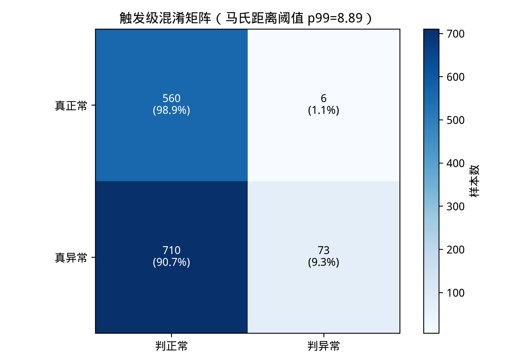
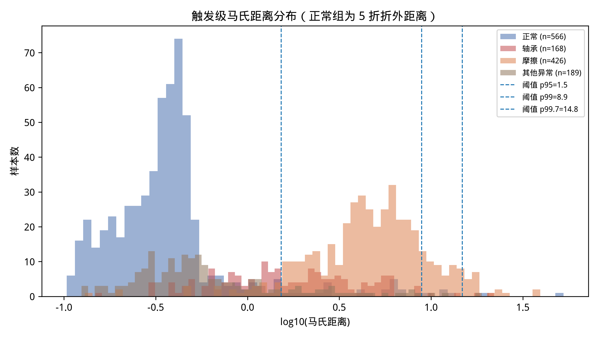
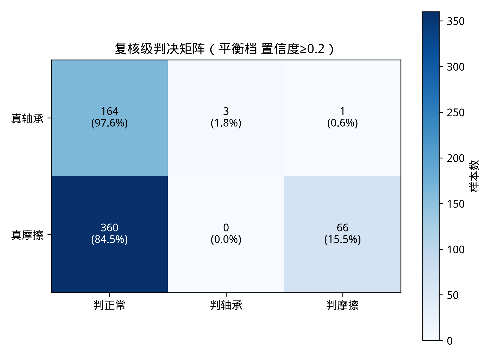
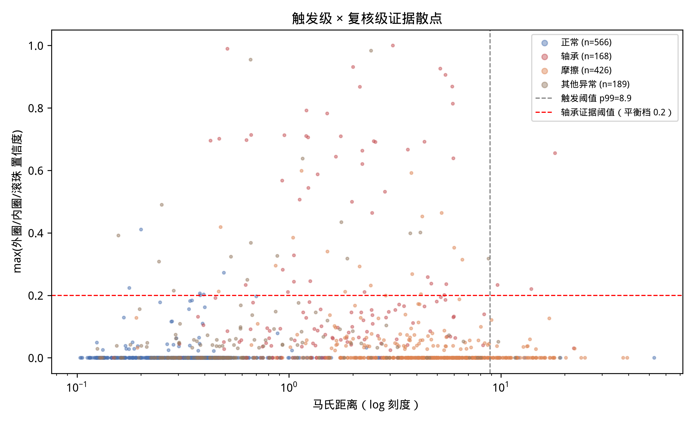
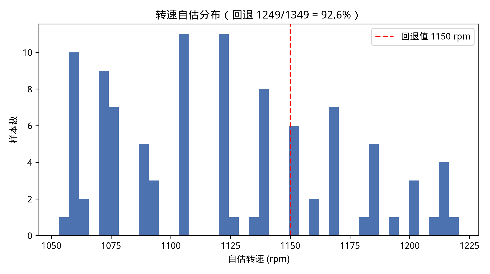

# 音频资产库评测报告（合并方案原型 · 级联门控）

- 生成时间：2026-09-21T15:57:57
- 评测脚本：`analysis/run_eval_audio_assets.py`；原型：`merged_proposal/unified_prototype.py`
- 数据：`analysis/reports/audio_assets/manifest.tsv`（清单导出的人工标注）
- 处理：成功 1349/1349 条，失败跳过 0 条；全量耗时 17.9 min（均值 0.80 s/条）

## 1. 口径声明

- `description` 为**人工标注的声称值，非拆解确认**；所有「准确率」应理解为与标注的一致率。
- 子集定义（严格遵守）：正常集 `file_label_status=1`；异常集 `=-1`；轴承子集 = 异常且 description **精确等于**「轴承」；摩擦子集 = 异常且 description **包含**「摩擦」；详细部位子集（参考）= 异常且含 外圈/内圈/滚珠。
- 削波样本（「爆量程」）无独立子集，按 description 归入「其他异常」（本次共 3 条）。
- 触发级阈值防泄漏：正常集 5 折交叉，阈值 = 折外马氏距离分位数；正常文件用折外距离，异常文件用全部正常样本拟合的基线。
- 复核级只做外圈/内圈/滚珠三类谐波匹配（保持架 FTF 出 scope）；滚珠主峰 2×BSF 由 BSF 二次谐波检索覆盖；匹配容差 ±2%。

## 2. 数据与子集

| 子集 | 条数 |
|---|---|
| 正常（status=1） | 566 |
| 异常（status=-1） | 783 |
| 　其中：轴承（精确「轴承」） | 168 |
| 　其中：摩擦（含「摩擦」） | 426 |
| 　其中：其他异常（含详细部位/故障/ng/空/爆量程等） | 189 |
| 　参考：详细部位（含 外圈/内圈/滚珠） | 86 |

## 3. 方法概要

级联门控（合并方案 §6.2）：零相位预处理（去直流/去趋势/sosfiltfilt 500–7500 Hz）→ 转速自估（包络谱 1×fr 峰，窗 17.5–20.5 Hz，失败回退 1150 rpm）→【触发级】马氏距离健康基线（特征：kurtosis/crest_factor/clearance_factor，kimi 检测级冲击性特征的纯时域子集）→【复核级】glm Kurtogram 选带 → 零相位解调 → glm matcher 三类谐波匹配。

## 4. 触发级：正常/异常判别

标定：正常集 566 条，5 折（折大小 [114, 113, 113, 113, 113]，seed=42）；折外距离 min/median/max = 0.10 / 0.36 / 52.72。

| 阈值（折外分位） | 阈值距离 | 异常检出率 | 正常误报率 | TP/FN/FP/TN |
|---|---|---|---|---|
| p95 | 1.53 | 65.9% (516/783) | 5.1% (29/566) | 516/267/29/537 |
| p99 | 8.89 | 9.3% (73/783) | 1.1% (6/566) | 73/710/6/560 |
| p99.7 | 14.80 | 2.8% (22/783) | 0.4% (2/566) | 22/761/2/564 |

各子集在不同分位阈值下的触发率（正常子集的触发率即误报率）：

| 阈值 | 正常 | 轴承 | 摩擦 | 其他异常 |
|---|---|---|---|---|
| p95（1.53） | 29/566（5.1%） | 85/168（50.6%） | 401/426（94.1%） | 30/189（15.9%） |
| p99（8.89） | 6/566（1.1%） | 4/168（2.4%） | 66/426（15.5%） | 3/189（1.6%） |
| p99.7（14.80） | 2/566（0.4%） | 2/168（1.2%） | 19/426（4.5%） | 1/189（0.5%） |

**触发级灵敏度塌陷的根因**：健康总体在冲击性特征上重尾——正常集峭度 p50/p95/p99/max = 3.1 / 4.3 / 332 / 902，即约 3.7% 的正常录音本身含强冲击瞬态。协方差被这些尾部样本撑大后，白化后的典型折外距离被压缩（中位仅 0.36），而 p99 阈值被尾部推到 8.9——轻中度异常（轴承子集峭度中位约 10）落在白化意义下「不算远」的位置，马氏距离的椭球假设在该重尾总体上失效（详见 §9）。

## 5. 复核级：轴承/摩擦判别

全体口径：未触发 = 该类漏检；触发后口径：只在触发样本中统计。默认触发阈值 p99。

| 预设（置信度阈值） | 子集 | n | 触发率 | 全体口径检出率 | 触发后口径检出率 | 判决分布 |
|---|---|---|---|---|---|---|
| 保守（≥0.3） | 轴承 | 168 | 2.4% | 0.6% | 25.0% | 判轴承1 / 判摩擦3 / 未触发164 |
| 保守（≥0.3） | 摩擦 | 426 | 15.5% | 15.5% | 100.0% | 判摩擦66 / 判轴承0 / 未触发360 |
| 平衡（≥0.2） | 轴承 | 168 | 2.4% | 1.8% | 75.0% | 判轴承3 / 判摩擦1 / 未触发164 |
| 平衡（≥0.2） | 摩擦 | 426 | 15.5% | 15.5% | 100.0% | 判摩擦66 / 判轴承0 / 未触发360 |
| 灵敏（≥0.1） | 轴承 | 168 | 2.4% | 1.8% | 75.0% | 判轴承3 / 判摩擦1 / 未触发164 |
| 灵敏（≥0.1） | 摩擦 | 426 | 15.5% | 15.0% | 97.0% | 判摩擦64 / 判轴承2 / 未触发360 |

**复核级单级判别力（参考，绕过触发级）**：轴承集有 47/168（28.0%）样本 max 置信度 ≥ 平衡档，而正常集仅 6/566（1.1%）——复核级本身的区分度远好于级联结果；但轴承集 44 条有证据样本被触发级拦下（未触发 = 漏检）。触发级是当前级联的瓶颈，详见 §8/§9。

### 低置信样本

低置信规则：触发 且 马氏距离 < 2×阈值 且 max 置信度 < 平衡档 0.2。共 **64 条**，子集分布：{'摩擦': 58, '其他异常': 2, '正常': 4}。
样本 id：10165, 10288, 10535, 10541, 10585, 10797, 10890, 10922, 11007, 11109, 11247, 11517, 11992, 12223, 12462, 12680, 13432, 13852, 13883, 14209, 14245, 14294, 14399, 14766, 14849, 15630, 15819, 16032, 16229, 16619 等（全部 64 条见 eval_detail.json）。

## 6. 参考：86 条详细部位标签的 argmax 一致率（不作正式结论）

- argmax(外圈/内圈/滚珠置信度) 与 description 部位的一致率：**26/86 = 30.2%**（外圈 23/28；滚珠 1/30；内圈 2/28）。
- 其中 max_conf=0（复核级无任何谐波证据）65 条，其 argmax 为并列退化值（取外圈），参考意义有限；只在有证据子集上：**5/21 = 23.8%**。

## 7. 转速自估

- 回退（包络谱 1×fr 峰 prominence < 5）：**1249/1349 = 92.6%**；回退值 1150 rpm。全体样本的 1×fr 峰突出度中位/p90 = 2.0/4.0，大多数信号根本没有可用的包络 1×fr 峰（强 2.2 kHz 电机音主导，轴频调制弱）。
- 非回退 100 条的 fr 分布：min/p25/中位/p75/max = 17.55/17.92/18.68/19.24/20.34 Hz；落在标称 18.33–20 Hz 内的比例 57.0%。
- 各子集回退：正常 561/566；轴承 123/168；摩擦 422/426；其他异常 143/189。

## 8. 与前一次 81 条数据集评测的对照（级联门控是否兑现互补）

前次评测（labeled_dataset_4class，轮次 B 口径）：glm **0 误报**（正常 10/10 正确）但故障检出仅 26/71（36.6%）；kimi **0 漏检**（71/71 全触发）但正常 10/10 全误报（固定阈值跨域失效）。合并方案的级联门控正是「kimi 灵敏触发 + glm 严格复核」的互补设计，且触发阈值改为域内标定（折外分位数），从机制上消除 kimi 的跨域失效。

本次（1349 条现场录音，p99 + 平衡档）结论分两半：

- **「glm 式低误报」兑现**：触发级正常误报率 1.1%（6/566，系 p99 标定的内禀水平），且经复核级仲裁后，最终「轴承」判决在正常集 0 误报、在 426 条摩擦集 0 误定类（平衡/保守档）；触发后被判「轴承」的轴承样本 3/4，复核级的严格性保留了 glm 的行为特征。
- **「kimi 式低漏检」未兑现**：触发级异常检出率仅 9.3%（73/783，p99），轴承子集触发率 2.4%。根因不是阈值标定方式（域内标定已生效、误报率受控），而是马氏距离的几何假设与本数据的健康总体不匹配——正常录音的冲击性特征重尾（峭度 max 902），协方差被尾部撑大后灵敏度塌陷（§4 末的量化证据）。值得注意的是，复核级单级（max 置信度 ≥ 0.2）在轴承集有 28.0% 的证据率、正常集仅 1.1%——若触发级修复，级联的检出上限远高于本次实测（§5 末）。

注意：两次评测数据不同（81 条台架四类 vs 1349 条现场含摩擦类），只能定性对照门控行为，不能直接比较检出率数值。

## 9. 局限与后续建议

1. **触发级灵敏度塌陷（本次最重要的负面发现）**：马氏距离假设健康特征近似椭球分布，而本数据集正常录音的冲击性特征重尾（约 3.7% 正常样本峭度 >5、最大 902），协方差被尾部主导，触发级成为级联瓶颈（轴承集复核级证据率 28.0%，级联后检出仅 1.8%）。建议（按代价排序）：(a) 冲击特征先做 log/秩变换再做马氏距离；(b) 换 robust 协方差（kimi ML 的 EllipticEnvelope 路径正是为此设计，合并方案移植项 3）；(c) 直接以单调冲击指标的分位数做触发（等效一维 EVT 思路）。该实验可复用本脚本快速验证。
2. 标签为声称值：description 未经拆解确认，一致率天花板受标签质量限制；「轴承」子集未区分部位，详细部位仅 86 条参考。
3. 转速自估高回退：现场信号的包络谱 1×fr 峰 prominence 普遍不足（全体中位 2.0 < 5），92.6% 样本回退 1150 rpm；真转速处于 1100/1200 窗口边缘时 ±2% 匹配容差可能覆盖不住（最大偏差约 4%），建议后续接入转速测量或用故障谱线族反演转速。非回退估计（100 条）中位 18.7 Hz，57% 落在标称窗内，方向合理但样本少。
4. 触发级特征只用了 3 维纯时域冲击性指标（env_max_ratio 依赖故障频率，按约定回退）；对「非冲击型」异常（如平稳异音）灵敏度有限，可考虑补充谱形态类特征。
5. 马氏距离基线用 566 条正常样本域内标定，对工况漂移敏感，跨设备/跨批次部署前需重新标定。
6. 「摩擦」判决是「触发但无轴承证据」的兜底类，不含摩擦的物理模型；摩擦子集中被判「轴承」的样本值得人工复听（可能是标注粒度问题）。
